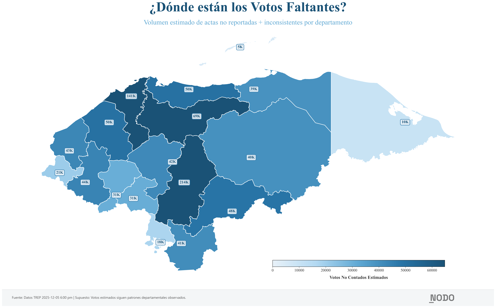
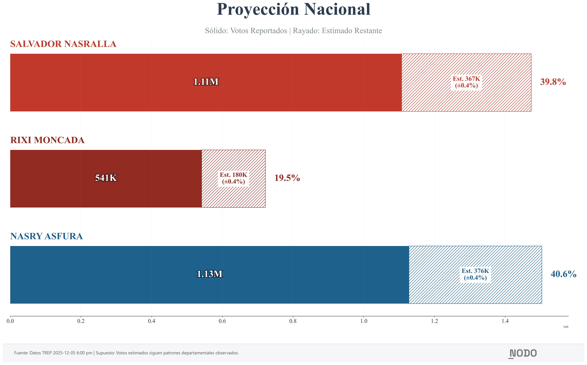

# Honduras 2025: Análisis de Datos Electorales Faltantes

<p align="center">
  
</p>

<p align="center">
  <strong>NODO Laboratorio de Investigación</strong><br>
  Análisis independiente de datos electorales · Honduras 2025
</p>

---

## Resumen Ejecutivo

Este repositorio contiene un análisis transparente y reproducible de los resultados electorales preliminares de Honduras (elecciones del 30 de noviembre de 2025), con enfoque en:

1. **Cuantificar la incertidumbre estructural**: ¿Cuántas actas faltan por reportar o están marcadas como inconsistentes?
2. **Visualizar la distribución geográfica**: ¿De dónde provienen los votos faltantes?
3. **Proyectar resultados bajo supuestos explícitos**: ¿Qué pasaría si las actas restantes siguen los patrones observados?

**Hallazgo clave**: Al momento de este análisis (5 de diciembre 2025, 6:00 pm), aproximadamente **25% del electorado** está representado por actas no reportadas o inconsistentes. El margen entre los dos candidatos líderes es de ~20,000 votos, pero el volumen de votos estimados en actas pendientes es de ~700,000.

---

## Resultados Visuales

### Mapa: ¿Dónde están los votos faltantes?



*Volumen estimado de votos válidos en actas no reportadas + inconsistentes por departamento.*

### Barras Departamentales: Reportado vs. Estimado


*Azul sólido: votos ya contabilizados. Naranja rayado: estimación de votos pendientes.*

### Proyección Nacional



*Proyección asumiendo que las actas restantes siguen los patrones departamentales observados.*

---

## Supuestos y Limitaciones

### Supuestos Clave

| Supuesto | Descripción | Impacto si es incorrecto |
|----------|-------------|--------------------------|
| **Proporcionalidad departamental** | Las actas faltantes de cada departamento votarán en proporciones similares a las actas ya contadas de ese mismo departamento | Alto: Si las áreas urbanas/rurales dentro de un departamento votan diferente, la proyección tendrá sesgo |
| **Datos TREP son representativos** | Los resultados preliminares reflejan la tendencia real | Bajo: El TREP es el sistema oficial de transmisión |

### Limitaciones Explícitas

1. **El margen de error estadístico (±0.4%) NO captura el riesgo de sesgo sistemático.** Si las actas faltantes provienen de zonas con preferencias políticas distintas a las ya contadas, la proyección será incorrecta.

2. **No hay validación histórica.** Este análisis no ha sido probado contra elecciones anteriores donde se conocen los resultados finales.

3. **Los datos cambian continuamente.** Este análisis es una instantánea del 5 de diciembre a las 6:00 pm.

### Qué NO es Este Análisis

- **No es una auditoría forense** de las actas
- **No es una denuncia de fraude** (ni afirma que no lo haya)
- **No es un resultado oficial** - es una proyección bajo supuestos explícitos

---

## Metodología Estadística

### Enfoque: Muestreo Aleatorio Estratificado con Corrección de Población Finita

Tratamos cada departamento como un estrato. La varianza del total proyectado se calcula como:

$$Var(\hat{T}) = \sum_{h=1}^{18} N_h^2 \left(1 - \frac{n_h}{N_h}\right) \frac{S_h^2}{n_h}$$

Donde:
- $N_h$ = Total de actas en el departamento $h$
- $n_h$ = Actas ya contabilizadas (correctas) en el departamento $h$
- $S_h^2$ = Varianza de votos por acta dentro del departamento $h$
- $(1 - n_h/N_h)$ = Corrección de población finita (FPC)

### Cálculo de Proyecciones

Para cada candidato $c$ en cada departamento $h$:

$$\hat{V}_{c,h} = V_{c,h}^{(obs)} + \left(\frac{V_{c,h}^{(obs)}}{V_{total,h}^{(obs)}}\right) \times \hat{R}_h$$

Donde $\hat{R}_h$ = votos estimados restantes en el departamento $h$.

### Resultados Estadísticos

| Métrica | Valor | Interpretación |
|---------|-------|----------------|
| Volumen estimado restante | ~25% | Porcentaje del total proyectado que proviene de estimaciones |
| Margen de error estadístico (95% CI) | ±0.40% | Asumiendo aleatorización dentro de estratos |
| Margen proyectado entre líderes | ~20,000 votos | Diferencia Asfura - Nasralla |
| Votos en actas pendientes | ~700,000 | Suficiente para alterar el resultado |

**Conclusión metodológica**: El margen de error estadístico es pequeño, pero *irrelevante* cuando el volumen de datos faltantes (~700K votos) excede ampliamente el margen entre candidatos (~20K votos).

---

## Reproducibilidad

### Requisitos

```bash
pip install pandas matplotlib numpy
```

### Estructura de Datos

```
conteo-2025/
├── data/dec_5/
│   ├── HN.PRESIDENTE.XX-DEPARTAMENTO.000-TODOS YYYY-MM-DD HH_MM_SS.json
│   ├── departamentos_actas_progress.csv
│   └── geoBoundaries-HND-ADM1.geojson
├── dec5_analysis_and_visuals.py
├── dec5_dazzle_viz.py
├── METODOLOGIA.md
└── logo_nodo.png
```

### Cómo Replicar con Datos Actualizados

#### Paso 1: Descargar JSONs del CNE

1. Visitar: **https://resultadosgenerales2025.cne.hn/results-presentation**
2. En el selector de departamentos, elegir cada departamento uno por uno
3. Hacer clic en **"Consultar"**
4. Una vez cargados los resultados, descargar el archivo JSON
5. Guardar en `data/dec_5/` con el formato: `HN.PRESIDENTE.XX-NOMBRE.000-TODOS YYYY-MM-DD HH_MM_SS.json`

#### Paso 2: Obtener la Tabla de Progreso de Actas

1. En la misma página del CNE, localizar la tabla inferior que muestra el progreso de actas por departamento
2. Tomar una **captura de pantalla** de la tabla
3. Abrir ChatGPT (u otro LLM con visión)
4. Subir la imagen y solicitar: *"Por favor convierte esta tabla en formato CSV con columnas: Departamento, Actas totalizadas, % totalizadas, Actas pendientes, % pendientes"*
5. Descargar el CSV y guardarlo como `data/dec_5/departamentos_actas_progress.csv`

#### Paso 3: Ejecutar el Análisis

```bash
python scripts/generar_visualizaciones.py
```

Las visualizaciones se generarán en `data/dec_5/visualizaciones/`.

---

## Verificación y Escrutinio

### Invitamos a:

1. **Descargar los datos originales** del CNE y verificar nuestras cifras
2. **Ejecutar el código** y confirmar que las visualizaciones son reproducibles
3. **Cuestionar los supuestos** y proponer escenarios alternativos
4. **Reportar errores** abriendo un issue en este repositorio

### Datos de Contacto

- **NODO Laboratorio de Investigación**
- Tegucigalpa, Honduras

---

## Contexto Electoral

Las elecciones generales de Honduras del 30 de noviembre de 2025 han sido marcadas por:

- Un margen históricamente estrecho entre los dos candidatos líderes
- Retrasos y fallas técnicas en el sistema de transmisión de resultados (TREP)
- Acusaciones cruzadas de fraude electoral
- Intervención pública del gobierno de Estados Unidos
- Escrutinio intenso de observadores internacionales (OAS, UE)

Este análisis busca aportar **claridad basada en datos** en un momento de alta incertidumbre y tensión política.

---

## Archivos del Repositorio

| Archivo | Descripción |
|---------|-------------|
| `scripts/analisis_y_procesamiento.py` | Carga y procesamiento de datos, funciones de análisis base |
| `scripts/generar_visualizaciones.py` | Generación de visualizaciones de alta calidad |
| `Metodología.md` | Documentación detallada del enfoque estadístico |
| `data/dec_5/*.json` | Datos crudos del CNE por departamento |
| `data/dec_5/departamentos_actas_progress.csv` | Progreso de actas (fuente: tabla CNE) |
| `assets/geoBoundaries-HND-ADM1.geojson` | Límites geográficos de departamentos |
| `assets/logo_nodo.png` | Logo de NODO para visualizaciones |

---

## Licencia y Uso

Este análisis es de dominio público. Los datos provienen del Consejo Nacional Electoral de Honduras.

Se permite y alienta:
- Reproducir el análisis
- Criticar la metodología
- Reutilizar el código
- Citar con atribución

---

<p align="center">
  <em>La transparencia no es una concesión. Es un requisito.</em>
</p>
